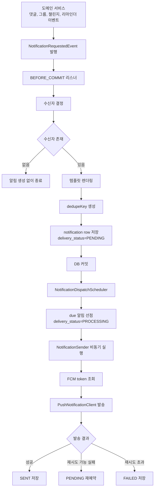
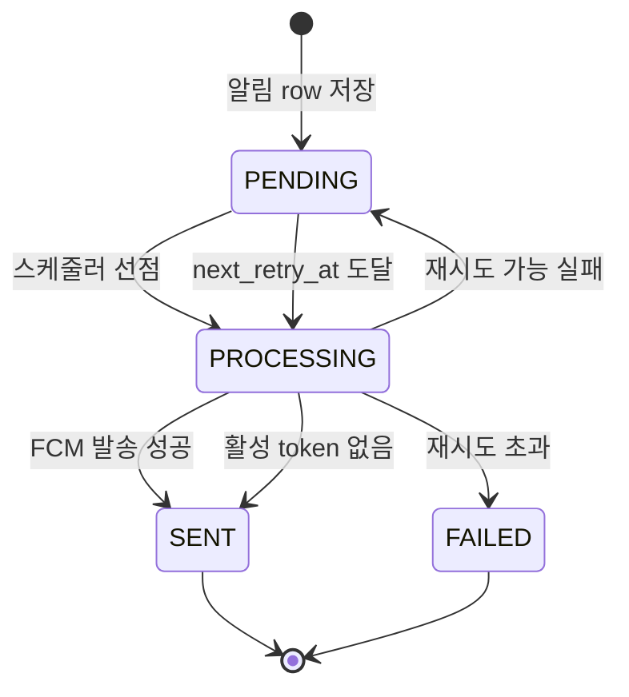

# LLD-0019: 알림 발송 아웃박스 아키텍처

> Low-Level Design. 이 문서는 알림 발송 구조 구현과 PR 본문의 **오라클(ground truth)** 이다.

| 항목 | 값 |
| --- | --- |
| 상태 | Accepted |
| Issue | #52 |
| 관련 ADR | ADR-0012, ADR-0018 |
| 작성자 | Codex |
| 작성일 | 2026-07-04 |

## 1. 목적 / 배경

알림 목록 조회와 읽음 처리는 구현되어 있지만,
댓글/챌린지/식사/운동 이벤트에서 알림을 생성하고 FCM으로 발송하는 구조는 별도 설계가 필요하다.
외부 푸시 발송이 핵심 도메인 트랜잭션을 깨지 않도록,
알림 row를 outbox로 사용하는 비동기 발송 구조를 채택한다.

## 2. 범위

### In scope

- 알림 요청 이벤트 모델.
- 수신자 결정, 템플릿 렌더링, 알림 row 저장.
- notification row 기반 outbox 상태 모델.
- 발송 대상 선점 스케줄러.
- 식사/운동 설정 기반 리마인더 이벤트 생성 스케줄러.
- 그룹 연속 기록 위험 알림 생성 스케줄러.
- 비동기 sender와 FCM push adapter.
- 실패 재시도와 최종 실패 상태 저장.
- FCM invalid token 비활성화.
- FCM token 저장 구조.
- 알림 보관 기간 정리 배치.
- 테스트 시나리오.

### Out of scope

- 실제 챌린지 도메인 이벤트 구현.

## 3. 핵심 흐름

```text
도메인 서비스
  -> NotificationRequestedEvent 발행
  -> BEFORE_COMMIT 리스너가 수신자/템플릿 계산
  -> notification row 저장(PENDING)
  -> 커밋
  -> NotificationDispatchScheduler가 due 알림 선점(PROCESSING)
  -> NotificationSender가 비동기 FCM 발송
  -> SENT 또는 PENDING retry 또는 FAILED 저장
```



도메인 서비스는 FCM을 직접 호출하지 않는다.
도메인 트랜잭션에서는 알림 row 저장까지만 수행한다.

## 4. 패키지 구조

```text
notification
  application
    NotificationRequestService
    NotificationRecipientResolver
    NotificationTemplateRenderer
    NotificationDispatchScheduler
    NotificationReminderScheduler
    NotificationStreakRiskScheduler
    NotificationRetentionScheduler
    NotificationSender
    PushNotificationClient
  application.event
    NotificationRequestedEvent
    NotificationRequestedEventListener
  infrastructure.fcm
    FirebaseInitializer
    FcmPushNotificationClient
    FcmProperties
  infrastructure.repository
    NotificationRepository
    MemberPushTokenRepository
  domain
    Notification
    NotificationType
    NotificationDeliveryStatus
    MemberPushToken
```

## 5. 이벤트 모델

```java
public record NotificationRequestedEvent(
    NotificationType type,
    Map<String, Object> payload,
    LocalDateTime scheduledAt,
    Long referenceId,
    String referenceType,
    String imageKey
) {
}
```

생성 헬퍼:

- `immediate(type, payload, referenceType, referenceId)`
- `scheduled(type, scheduledAt, payload, referenceType, referenceId)`

`scheduledAt == null`이면 `LocalDateTime.now()`로 저장한다.

## 6. 수신자 결정

`NotificationRecipientResolver`는 알림 타입과 payload로 수신 회원 id 목록을 결정한다.

- `GROUP_MEMBER_JOINED`: 새로 참여한 회원을 제외한 같은 그룹의 기존 활성 구성원.
- `EXERCISE_REMINDER`: 해당 요일/시간 운동 알림이 켜진 본인.
- `MEAL_REMINDER`: 해당 식사 알림이 켜진 본인.
- `COMMENT_CREATED`: 기록 작성자. 단, 댓글 작성자 본인은 제외한다.
- `GROUP_RECORD_STREAK_RISK`: 당일 기록이 없어 그룹 연속 기록을 끊을 위험이 있는 본인.
- `BUDDY_NUDGE`: 찌르기 대상 회원.
- `STEP_CHALLENGE_COMPLETED`: 챌린지에 참여 중인 그룹 활성 구성원.
- `WEEKLY_CHALLENGE_COMPLETED`: 챌린지에 참여 중인 그룹 활성 구성원.

수신자 목록이 비어 있으면 알림 row를 만들지 않고 종료한다.

## 7. 템플릿 렌더링

`NotificationTemplateRenderer`는 `NotificationType`별 title/body 템플릿을 가진다.

확정 템플릿:

| 타입 | title | body |
| --- | --- | --- |
| GROUP_MEMBER_JOINED | ${groupName}에 새 버디가 참여했어요! | ${nickname}님을 환영해주세요! |
| EXERCISE_REMINDER | 운동할 시간! | 오운완 사진 찍어서 기록해주세요! |
| MEAL_REMINDER | 식사할 시간! | 오늘은 어떤 식사를 하셨나요? 궁금해요~ |
| COMMENT_CREATED | 버디가 내 게시물에 코멘트를 달았어요 | 어떤 이야기를 남겼는지 확인하러 가요! |
| GROUP_RECORD_STREAK_RISK | ${nickname}님 어디가셨나요 ㅠㅠ | 오늘 기록하지 않으면 그룹 연속 기록이 깨져요! |
| BUDDY_NUDGE | ${nickname}님이 콕 찔렀어요! | ${nickname}님의 응원을 받고 기록해주세요! |
| STEP_CHALLENGE_COMPLETED | ${destination}까지 걸어가기 완료! | ${destination}을 걸어서 방문했어요 |
| WEEKLY_CHALLENGE_COMPLETED | 이번주 챌린지 완료! | 모두 인증해서 이번주 챌린지 1개를 완료했어요 |

필수 payload가 없으면 `NOTIFICATION301` 계열 검증 에러로 처리한다.

## 8. 알림 정책

- 그룹 참여 알림은 실제 그룹명을 사용하고, 새로 참여한 본인에게는 발송하지 않는다.
- 식사 알림은 아침/점심/저녁 설정에 따라 발송한다.
- 식사 기록의 `먹지 않음`도 해당 식사 기록 완료로 인정한다.
- 운동 알림은 회원이 등록한 요일-시간 일정에 맞춰 발송한다.
- 운동 일정은 최소 3개 이상 유지한다.
- 댓글 알림은 작성자 본인이 자기 기록에 댓글을 단 경우 발송하지 않는다.
- 버디 찌르기는 같은 대상에게 하루 1회만 발송한다.
- 그룹 연속 기록 위험 알림은 미기록자 본인에게만 하루 1회 발송한다.
- 걸음수 챌린지 완료 알림은 목적지 도달 시점에 이벤트당 1회 발송한다.
- 주간 챌린지 완료 알림은 전원 인증 완료 시점에 이벤트당 1회 발송한다.
- 푸시 발송에 실패해도 앱 내 알림 row는 유지한다.
- 읽음 상태와 푸시 발송 상태는 독립적으로 관리한다.
- FCM이 `UNREGISTERED` 또는 토큰 단위 `INVALID_ARGUMENT`를 반환하면 해당 token을 비활성화한다.

## 9. 데이터 모델

### notification

기존 알림 테이블에 발송 outbox 필드를 확장한다.

- `receiver_member_id`
- `notification_type`
- `title`
- `content`
- `image_key`
- `reference_type`
- `reference_id`
- `scheduled_at`
- `delivery_status`: `PENDING`, `PROCESSING`, `SENT`, `FAILED`
- `sent_at`
- `picked_by`
- `picked_at`
- `retry_count`
- `max_retry`
- `next_retry_at`
- `dedupe_key`
- `last_error`
- `read_at`

읽음 여부는 `read_at != null`로 판단한다.
발송 상태와 읽음 상태는 서로 독립적이다.



권장 인덱스:

- `idx_notification_receiver_created(receiver_member_id, created_at)`
- `idx_notification_dispatch(delivery_status, scheduled_at, next_retry_at, picked_by)`
- `uk_notification_dedupe(dedupe_key)`

### member_push_token

FCM token은 회원과 별도 테이블로 관리한다.

- `id`
- `member_id`
- `device_id`
- `platform`: `IOS`, `ANDROID`
- `fcm_token`
- `enabled`
- `last_seen_at`
- `deleted_at`

동일 기기 재등록 시 `device_id` 기준으로 token을 갱신한다.
device id를 안정적으로 받을 수 없으면 `fcm_token` 기준으로 중복을 방지한다.

## 10. 알림 생성 트랜잭션

`NotificationRequestedEventListener`는 `@TransactionalEventListener(phase = BEFORE_COMMIT)`로 동작한다.

처리 순서:

1. 이벤트 타입 검증.
2. 수신자 목록 계산.
3. 템플릿 렌더링.
4. 수신자별 `dedupeKey` 생성.
5. `notification` row 저장.
6. 중복 key 충돌은 이미 생성된 알림으로 보고 무시한다.

`dedupeKey` 예시:

```text
COMMENT:RECORD:recordId:receiverMemberId
CHALLENGE:GROUP_CHALLENGE:challengeId:receiverMemberId
RECORD_REMINDER:DATE:memberId:recordType:yyyyMMdd
GROUP_RECORD_STREAK_RISK:DATE:memberId:groupId:yyyyMMdd
BUDDY_NUDGE:DATE:senderMemberId:receiverMemberId:yyyyMMdd
```

## 11. 발송 선점 스케줄러

`NotificationDispatchScheduler`는 짧은 주기로 발송 대상을 선점한다.

조건:

- `delivery_status = PENDING`
- `scheduled_at <= now`
- `next_retry_at is null or next_retry_at <= now`
- `deleted_at is null`

처리:

1. due 알림을 `FOR UPDATE SKIP LOCKED`로 조회해 현재 트랜잭션에서 잠근다.
2. 잠근 알림을 `PROCESSING`, `picked_by`, `picked_at`으로 변경한 뒤 커밋한다.
3. 선점한 알림 id를 `NotificationSender.sendAsync(id)`로 넘긴다.

MySQL 8.0에서는 `FOR UPDATE SKIP LOCKED` 기반 선점 쿼리를 사용한다.
H2 테스트에서는 repository fake 또는 단순 조회 방식으로 검증한다.

## 12. 알림 생성 스케줄러

알림 생성 스케줄러는 FCM을 직접 호출하지 않는다.
조건에 맞는 `NotificationRequestedEvent`를 생성하고,
알림 저장, 중복 방지, 발송은 동일한 outbox 흐름에 위임한다.

### 식사/운동 리마인더

`NotificationReminderScheduler`

- 기본 비활성화: `NOTIFICATION_REMINDER_ENABLED=false`.
- 기본 cron: 매분 0초.
- 현재 시각을 분 단위로 절삭해 설정된 식사/운동 시간과 비교한다.
- 식사 알림은 아침/점심/저녁별 설정 시간이 현재 시각과 같은 회원에게 생성한다.
- 운동 알림은 현재 요일과 시간이 회원 운동 일정과 같은 경우 생성한다.
- 각 알림은 `memberId + date + mealType/scheduledTime` 단위로 dedupe한다.

### 그룹 연속 기록 위험 알림

`NotificationStreakRiskScheduler`

- 기본 비활성화: `NOTIFICATION_STREAK_RISK_ENABLED=false`.
- 기본 cron: 매일 21:00.
- 활성 그룹 멤버를 batch size만큼 조회한다.
- 해당 날짜에 해당 그룹 기록이 없는 회원만 대상으로 한다.
- 회원의 streak 알림 설정이 꺼져 있으면 생성하지 않는다.
- `groupId + memberId + date` 단위로 dedupe한다.

### 알림 보관 기간 정리

`NotificationRetentionScheduler`

- 기본 비활성화: `NOTIFICATION_RETENTION_ENABLED=false`.
- 기본 cron: 매일 04:00.
- 기본 보관 기간: 90일.
- `createdAt < now - retentionDays` 이고 `deletedAt is null`인 알림을 batch size만큼 조회한다.
- 조회된 알림은 물리 삭제하지 않고 `BaseEntity.delete()`로 소프트 삭제한다.

## 13. 비동기 발송

`NotificationSender`는 `@Async("notificationExecutor")`와
`@Transactional(propagation = REQUIRES_NEW)`를 사용한다.

처리 순서:

1. 알림 id로 알림을 다시 조회한다.
2. 상태가 `PROCESSING`인지 확인한다.
3. 수신자의 활성 FCM token 목록을 조회한다.
4. token이 없으면 `SENT`로 처리하되 `sent_at`만 기록한다.
5. `PushNotificationClient.send(notification, tokens)`를 호출한다.
6. 성공하면 `SENT`로 변경한다.
7. FCM이 invalid token을 반환하면 해당 token을 비활성화한다.
8. 실패하면 retry 가능 여부에 따라 `PENDING`으로 재예약하거나 `FAILED`로 변경한다.

재시도 backoff 기본값:

- 1회차: 1분
- 2회차: 5분
- 3회차: 30분

## 14. FCM 어댑터

`FcmPushNotificationClient`는 Firebase Admin SDK를 사용한다.

초기화:

- `FirebaseInitializer`가 애플리케이션 시작 시 FirebaseApp을 1회 초기화한다.
- credential은 환경변수로 주입한 파일 경로 또는 Secret mount 경로를 사용한다.
- 로컬/테스트에서는 `NoOpPushNotificationClient` 또는 fake를 사용한다.

발송:

- FCM token은 최대 500개 단위로 나누어 전송한다.
- `MulticastMessage`에 title/body를 넣고 `FirebaseMessaging.sendEachForMulticast`를 호출한다.
- 부분 실패는 token별로 로그를 남기고 invalid token 목록을 sender에 반환한다.
- `UNREGISTERED`, token 단위 `INVALID_ARGUMENT`는 invalid token으로 취급한다.
- 전체 호출 실패는 sender가 재시도 정책으로 처리할 수 있게 예외를 던진다.

## 15. 환경 변수

```yaml
notification:
  dispatch:
    enabled: true
    fixed-delay-ms: 10000
    batch-size: 100
    max-retry: 3
  reminder:
    enabled: false
    cron: "0 * * * * *"
  streak-risk:
    enabled: false
    cron: "0 0 21 * * *"
    batch-size: 500
  retention:
    enabled: false
    cron: "0 0 4 * * *"
    retention-days: 90
    batch-size: 500
  push:
    provider: fcm
    title: Mody
fcm:
  enabled: true
  credentials-path: ${FCM_CREDENTIALS_PATH:}
```

운영에서는 `FCM_CREDENTIALS_PATH`에 서버에 배치한 Firebase service account JSON 경로를 주입한다.

## 16. 예외 / 에러 처리

- 알림 타입 미지원: `NOTIFICATION301`.
- 알림 없음 또는 접근 불가: `NOTIFICATION302`.
- 알림 payload 검증 실패: `NOTIFICATION303`.
- FCM 설정 오류: `NOTIFICATION501`.
- FCM 발송 실패: sender 내부 retry 대상으로 처리하고 API 응답으로 직접 노출하지 않는다.

## 17. 테스트 시나리오

- 이벤트 수신 시 같은 트랜잭션 안에서 알림 row가 생성된다.
- 수신자가 없으면 알림 row가 생성되지 않는다.
- dedupe key가 같으면 중복 알림을 만들지 않는다.
- 그룹 참여 알림은 새로 참여한 본인을 제외하고 기존 구성원에게만 생성된다.
- 댓글 작성자 본인이 기록 작성자이면 댓글 알림을 생성하지 않는다.
- `먹지 않음` 식사 기록은 해당 식사 리마인더 완료 상태로 판단한다.
- 버디 찌르기는 같은 대상에게 같은 날짜에 1회만 생성된다.
- 그룹 연속 기록 위험 알림은 미기록자 본인에게만 생성된다.
- 걸음수/주간 챌린지 완료 알림은 완료 이벤트당 1회만 생성된다.
- scheduler는 due 상태 알림만 선점한다.
- 식사/운동 리마인더 스케줄러는 현재 시간과 설정 시간이 같은 대상만 이벤트를 생성한다.
- 그룹 연속 기록 위험 스케줄러는 당일 기록이 없는 그룹 멤버만 이벤트를 생성한다.
- 알림 보관 기간 정리 배치는 오래된 알림을 소프트 삭제한다.
- sender는 성공 시 `SENT`와 `sent_at`을 저장한다.
- sender는 실패 시 retry count와 next retry time을 저장한다.
- retry count가 한도를 넘으면 `FAILED`와 last error를 저장한다.
- FCM invalid token은 비활성화한다.
- 다른 회원의 FCM token으로 발송하지 않는다.
- FCM client 테스트는 fake `PushNotificationClient`를 사용한다.

## 18. 미결정 사항 (Open Questions)

- quiet time 또는 야간 발송 제한을 적용할지 결정 필요.
- 배치 실행 이력 테이블을 둘지 결정 필요.
- 외부 큐/워커로 분리할 운영 임계치 결정 필요.
